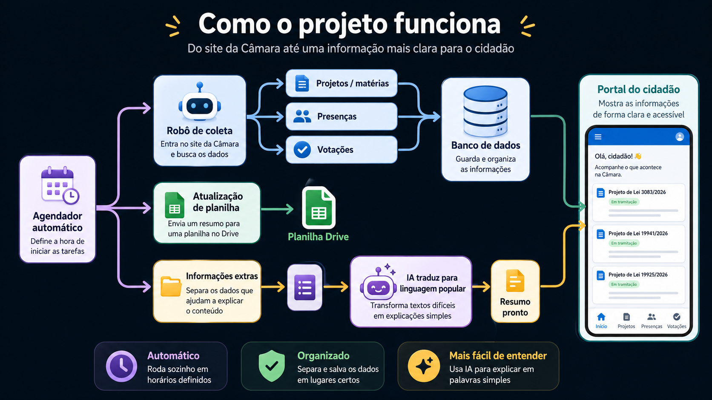

  

# 🏛️ Farol da Cidadania

O **Farol da Cidadania** é um portal open-source capaz de agrupar dados da câmara municipal e facilitar as interações da comunidade. Nosso principal objetivo é tornar o processo legislativo mais **transparente, simplificado e acessível** para a população.

---

## ⚙️ Como Funciona a Captura de Dados?

Para não sobrecarregar os portais governamentais e garantir um fluxo de informações sempre atualizado, todo o nosso ecossistema de coleta de dados é centralizado em nosso **Agendador (Scheduler)**. 

O sistema atua em 3 fases fundamentais:
1. **Captura:** Coleta as informações públicas (matérias, vereadores, etc) diretamente do site da prefeitura/câmara.
2. **Dados Abertos:** Sincroniza e atualiza as informações alteradas em planilhas e bases de dados públicas.
3. **Simplificação:** Processa e simplifica os dados textuais (traduzindo o "juridiquês") para facilitar a leitura da comunidade.

---

## 🎼 O Maestro: `scheduler.py`

O arquivo `integrations/scheduler.py` é o coração do nosso sistema de automação. Ele é responsável por orquestrar a captura de dados, atualizar nossas planilhas e gerar os resumos simplificados.

### 🔄 Jobs em Produção

- 📄 **`run_get_materias`**: Extrai e atualiza os dados das matérias legislativas (projetos de lei, requerimentos, indicações, etc). *(Utiliza CheckTime)*
- 👤 **`run_get_vereadores`**: Mantém a base de dados do perfil dos vereadores sempre atualizada. *(Utiliza CheckTime)*

### 🚀 Roadmap e Próximos Passos (Features)

Estamos trabalhando ativamente para expandir nosso nível de transparência:

- 🗳️ **`run_get_votacoes`**: Extração de informações de votações diretamente dos PDFs publicados. *(Com CheckTime)*
- 🙋‍♂️ **`run_get_presencas`**: Monitoramento da presença dos vereadores nas sessões plenárias. *(Com CheckTime)*
- 📊 **`run_update_planilha`**: Varredura de matérias que sofreram atualizações de tramitação para sincronizar na planilha de Dados Abertos (nossa integração captura alterações via *signals* no Django e as lista na fila `sheets_pendentes`). *(Sem CheckTime)*
- 🤖 **`run_new_materias_ai`**: Fila de processamento que lista todas as matérias brutas e utiliza Inteligência Artificial para **"minificá-las"**, tornando o texto jurídico palatável para a população. *(Sem CheckTime)*

---

## 🕒 Responsabilidade e Regras de Execução (`CheckTime`)

Como um projeto ético, nos preocupamos em não realizar requisições abusivas. Para evitar processamento desnecessário e respeitar os servidores do governo, utilizamos o **`CheckTime`**. 

Ele verifica se o sistema está dentro da "janela de operação" permitida, que ocorre de **Segunda a Sexta-feira, das 07:30 às 20:00**. Essa abordagem foi escolhida devido à baixa taxa de mudança de dados e publicação de novas matérias fora desse período.
